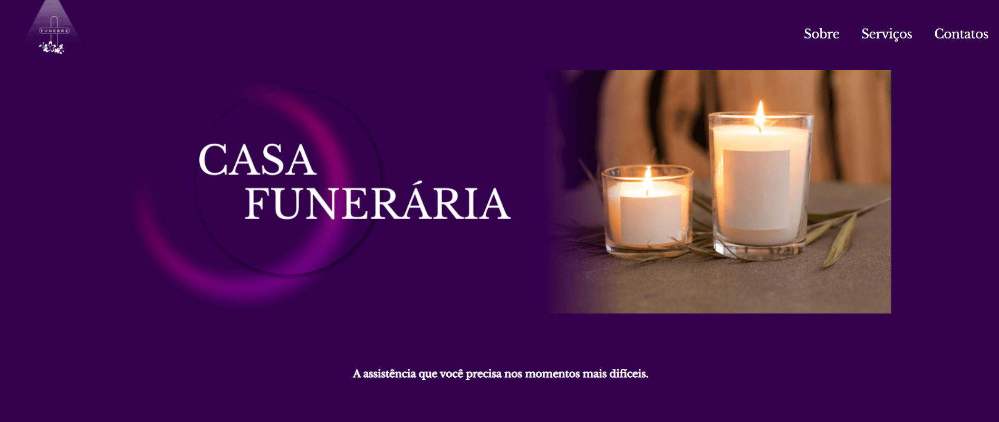

# Funebre - funeraria
Site onepage para uma funerária. Logo e layout pensados por Jhuly Ambrozini.
Esta aplicação está disponível online no endereço: [Funebre](https://funebre.vercel.app/).

## Tecnologias utilizadas
- HTML5
- CSS3
- SASS
- Parcel

## Como rodar o projeto
- Baixar ou clonar este repositório, no terminal executar `npm i` ou `npm install`
- Para executar o parcel, usar o comando `npm run dev`

